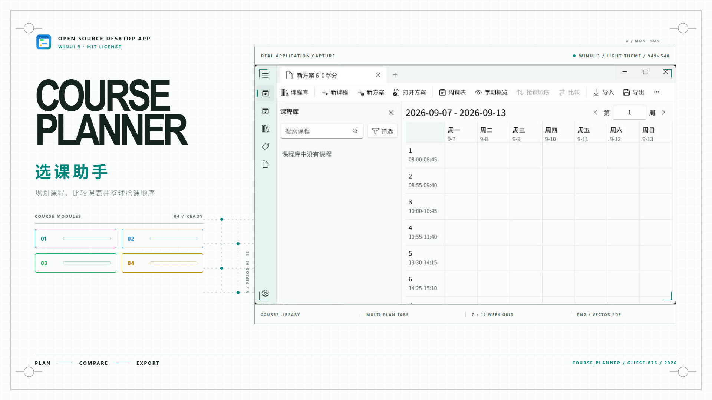

<p align="center">
  
</p>

<h1 align="center">Course Planner · 选课助手</h1>

<p align="center">
  <strong>把课程资料变成可比较、可执行的选课方案。</strong><br />
  一款本地优先、原生流畅的 Windows 选课规划工具。
</p>

<p align="center">
  <a href="./README_EN.md">English</a> ·
  <a href="https://github.com/Gliese-876/Course-Planner/releases/latest">下载安装</a> ·
  <a href="./docs/json-import-guide.md">JSON 导入教程</a>
</p>

<p align="center">
  <a href="https://github.com/Gliese-876/Course-Planner/releases/latest"></a>
  
  
  
</p>

<picture>
  <source media="(prefers-color-scheme: dark)" srcset="./docs/posters/course-planner-dark.png" />
  
</picture>

## 认识 Course Planner

Course Planner 把学期、标签、课程库和多个候选方案放进同一个工作区。你可以先试排课表、比较取舍、发现时间冲突，再整理抢课顺序并导出结果。课程数据默认保存在本机，核心规划流程不依赖账号或云服务。

| 能力 | 用途 |
|---|---|
| 多方案规划 | 在多个方案标签页之间试排，并并排比较新增、移除、替换与冲突 |
| 多维课表 | 查看单周、学期总览与双方案对比 |
| 抢课顺序 | 结合余量、选课压力和替代项生成建议，也可手动调整 |
| 课程资料库 | 管理学期、节次、分类、标签、课程和上课时间 |
| 导入与导出 | 支持课程库 JSON、方案 JSON、分享文本、PNG 与矢量 PDF |
| 本地可靠性 | SQLite 持久化、撤销/重做、导入预览、备份与恢复 |
| 原生体验 | WinUI 3、Mica、响应式布局、浅色/深色/跟随系统主题与中英文界面 |

## 安装

### 系统要求

- Windows 10 版本 1809（Build 17763）或更新版本。
- x64 设备。
- Release 包为自包含安装包，普通用户无需安装 .NET SDK、Visual Studio 或 Windows App SDK Runtime。

### 推荐：从 GitHub Releases 安装

1. 打开[最新版本页面](https://github.com/Gliese-876/Course-Planner/releases/latest)。
2. 下载 `CoursePlanner-v版本号-x64.zip` 和 `SHA256SUMS.txt`。
3. 可选但推荐：使用 `Get-FileHash` 核对压缩包的 SHA-256。
4. 解压 ZIP，双击 `Install-CoursePlanner.cmd`。

也可以在解压目录打开 Windows PowerShell，手动运行：

```powershell
powershell -NoProfile -ExecutionPolicy Bypass -File .\Install-CoursePlanner.ps1
```

安装程序会先确认 MSIX 的签名证书与随包证书完全一致，再征求你的确认。首次安装会通过 UAC 将发布者证书加入“本地计算机 → 受信任人”，随后为当前 Windows 用户安装应用；后续使用同一证书签名的更新通常无需再次提升。安装后可从开始菜单启动 Course Planner。

> [!IMPORTANT]
> 当前 GitHub 版本使用项目自签名证书进行旁加载。请只从本仓库的 Releases 页面下载，并在安装前核对校验和。后续若通过 Microsoft Store 或受信任代码签名发布，将不再需要手动信任自签名证书。

如果不想运行脚本，也可以以管理员身份把 Release 中的 `.cer` 安装到“本地计算机 → 受信任人”，再双击 `.msix`。卸载时打开“设置 → 应用 → 已安装的应用”，找到 Course Planner 并选择“卸载”。

## 快速上手

1. 在“学期”中设置起止日期、每周起始日与节次表。
2. 在“标签”和“课程库”中建立分类、课程与上课时间。
3. 新建多个方案，把候选课程加入不同方案。
4. 使用周视图、学期总览和方案对比检查冲突与取舍。
5. 打开抢课顺序窗口，接受建议或拖动调整。
6. 导出课表、分享文本、课程库 JSON 或方案 JSON。
7. 在设置页创建备份。跨设备迁移完整状态时，请使用“备份与恢复”，而不是 JSON 交换文件。

## JSON 导入教程

需要批量录入课程、共享课程库或传递选课方案时，请阅读[完整 JSON 导入教程](./docs/json-import-guide.md)。教程包含：

- `courseLibrary` 与 `selectionPlan` 两种包结构；
- 每个字段、数字枚举、日期与时间格式；
- `offeringId` 的计算和检查方法；
- 导入限制、预览流程、常见错误与排查方式。

可直接从经过当前导入器验证的文件开始：

- [课程库示例](./docs/examples/course-library.json)
- [选课方案示例](./docs/examples/selection-plan.json)
- [课程 ID 检查脚本](./scripts/Get-CourseOfferingId.ps1)

## 从源码构建

开发环境需要 Windows x64、[.NET SDK 10.0.301](./global.json) 或兼容的更新 feature band，以及已启用的 Windows 开发人员模式。Visual Studio 不是必需的。

```powershell
dotnet restore .\CoursePlannerWorkspace.slnx --locked-mode
dotnet build .\CoursePlannerWorkspace.slnx --configuration Debug --no-restore
dotnet run --project .\CoursePlanner\CoursePlanner.csproj --configuration Debug --runtime win-x64
```

提交代码前运行完整检查：

```powershell
pwsh .\scripts\Test-Ci.ps1
```

### 发布维护者

正式版本采用“本地构建、云端签名”：本机完成恢复、构建、完整测试与 MSIX 打包，再把临时签名的包上传到草稿 Release；GitHub 工作流只校验 SHA-256、使用固定发布证书重新签名，并生成最终安装资产，不在云端构建或测试应用。

- `COURSE_PLANNER_PFX_BASE64`：加密 PFX 的 Base64 内容。
- `COURSE_PLANNER_PFX_PASSWORD`：PFX 密码。
- 不要把 PFX、私钥、密码、临时签名目录或构建产物提交到仓库。
- 后续版本必须继续使用同一发布证书；更换证书会要求现有用户重新信任新的发布者。
- 发布机还需要已登录的 GitHub CLI（`gh`）和位于 `PATH` 中的 WinApp CLI（`winapp`）。
- 从干净的发布提交创建并推送 `vMAJOR.MINOR.PATCH` 标签，然后运行 `pwsh .\scripts\Stage-Release.ps1 -Tag v版本号`。脚本会在本地执行完整验证、使用一次性证书构建暂存包，并触发仅签名工作流；固定私钥不会被下载到本机。若必须把修订合并回同一个三段版本，应先将既有 Release 转为草稿、把同名标签更新到新的干净发布提交，再用递增的第四段包修订号运行，例如 `pwsh .\scripts\Stage-Release.ps1 -Tag v1.0.1 -PackageRevision 1`；Release 名称仍是 `v1.0.1`，但已安装的旧包可以原位升级。

## 参与贡献

欢迎提交 Issue、改进文档或贡献代码。新增行为应附带测试；UI 变更请同时检查浅色、深色、中文和英文环境。

本项目由 [Gliese-876](https://github.com/Gliese-876) 发布，采用 [MIT 许可证](./LICENSE)。
